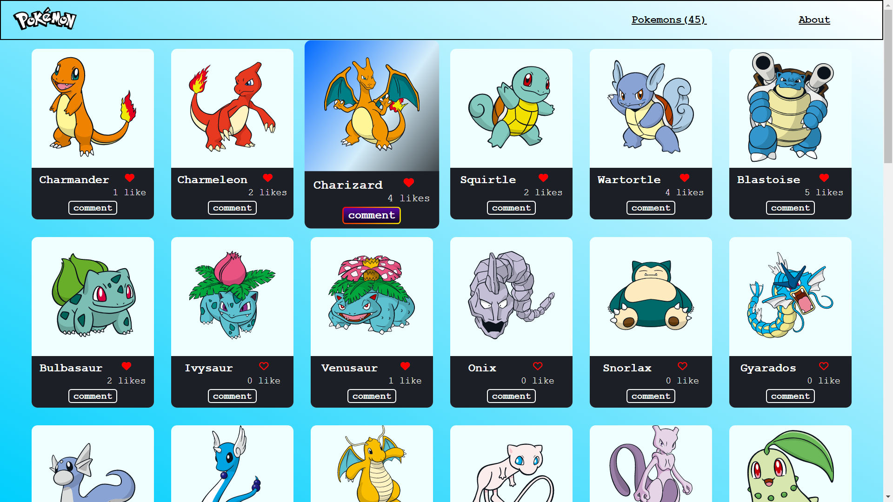
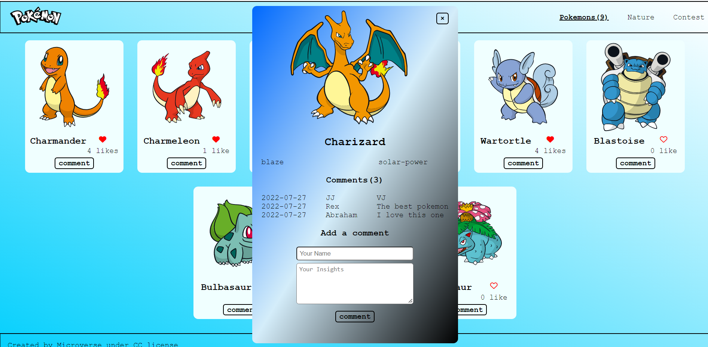
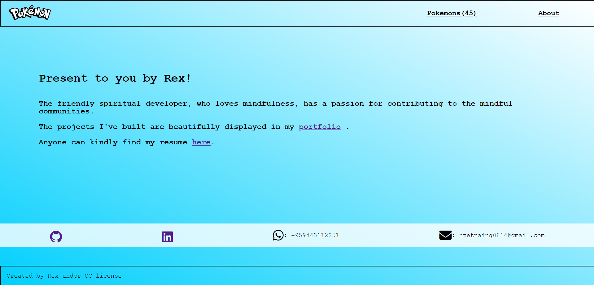

# Pokeverse

> The amazing Pokeverse presents you the following:
>
> 1. displays the list of the Pokemons and their abilities fetched from the [Pokeapi](https://pokeapi.co)
> 2. Users can like and comment about the pokemons. Like and comment features are provided by the [InvolvementApi](https://www.notion.so/Involvement-API-869e60b5ad104603aa6db59e08150270)

## Screenshots

- **Pokemons Page**

- **Detail of the pokemon**

- **About Page**

## Built With

- HTML
- CSS
- JS
- Webpack
- Jest

## Live Demo

[Pokeverse](https://rex-9.github.io/Pokeverse/)

## Getting Started

To get a local copy up and running:

1. Clone this repository or download the zip folder:

**`git clone https://github.com/rex-9/Pokeverse.git`**

2. Navigate to the location of the folder in your machine:

**`you@your-Pc-name:~$ cd Pokeverse`**

3. Open the project with VScode:

**`code .`**

3. Install the node packages:

**`npm install`**

4. Build the node packages:

**`npm run build`**

5. Initialize the webpack config file:

**`npx webpack`**

6. Run the webpack dev server:

**`npm run start`**

### Deployment

Here is the online version of [Pokeverse](https://rex-9.github.io/Pokeverse/)

## Author1

👤 - Github: [@rex-9](https://github.com/rex-9/) 
👤 - LinkedIn: [Htet Naing](https://www.linkedin.com/in/rex9/) 
👤 - Facebook: [Htet Naing](https://www.facebook.com/htetnaing0814) 
👤 - Angelist: [Htet Naing](https://angel.co/u/rex9) 

## 🤝 Contributions

Contributions, issues, and feature requests are welcome!

Feel free to check [issue page](https://github.com/rex-9/Pokeverse/issues).

## Show your support

Give a ⭐️ if you like this project!

## Acknowledgments

[Microverse](https://bit.ly/MicroverseTN)

## 📝 License

This project is [MIT](./MIT.md) licensed.
